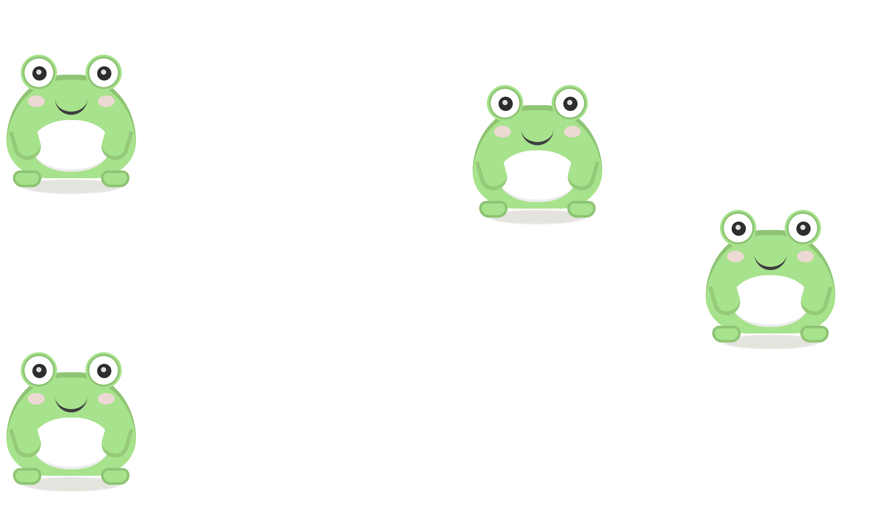

# 🐸 Froggy

A delightfully useless HTML plugin that pokes fun at the infamous [LeetCode #403 Frog Jump](https://leetcode.com/problems/frog-jump/description/) problem.



## What is this?

Remember spending hours optimizing dynamic programming solutions for that frog to cross the river? Well, now you can watch a frog make completely random, mathematically unsound jumps with zero regard for algorithmic efficiency!

## Features

- 🎯 **Random Chaos**: Click the frog and watch it hop a completely random number of steps
- 🧠 **No DP Required**: Zero memoization, zero optimization, maximum chaos
- 🌊 **River? What River?**: This frog doesn't care about stone positions or valid jump sequences
- 💚 **Therapeutic**: Perfect for when you need a break from actually solving the real problem

## Installation

<!-- ### CDN (Recommended)
```html
<script src="https://cdn.jsdelivr.net/npm/froggy-plugin/dist/froggy.min.js"></script>
``` -->

### Local Installation
1. Download the latest release
2. Include the files in your HTML:
```html
<script src="froggy/dist/froggy.min.js"></script>
```

## Usage

### Basic Usage

1. Create a container element:
```html
<div id="my-frog"></div>
```

2. Initialize the chaos:
```javascript
const frog = new Froggy('#my-frog');
```

That's it! The plugin automatically generates the frog HTML structure and handles all the hopping madness.

### Advanced Options

```javascript
const frog = new Froggy('#my-frog', {
    stepSize: 150,           // Pixels per step (default: 120)
    maxSteps: 5,            // Maximum steps per hop (default: 3)
    minSteps: 1,            // Minimum steps per hop (default: 1)
    initialPosition: {       // Starting position
        left: 200,
        top: 150
    }
});
```

### Multiple Frogs

```javascript
// Create chaos with multiple frogs
const frogs = Froggy.createMultiple(['#frog1', '#frog2', '#frog3'], { randomizePosition: true });
```

### Events

Listen for hop events:
```javascript
document.getElementById('my-frog').addEventListener('frogHop', (event) => {
    console.log('Frog hopped!', event.detail);
});
```

### Methods

```javascript
// Move frog to specific position
frog.moveTo(100, 200);

// Trigger a hop programmatically
frog.hop();

// Clean up
frog.destroy();
```

## Usage

Simply click the frog and watch it hop! Unlike the LeetCode problem:
- No need to check if jumps are valid
- No stone positions to worry about
- No reaching the other side required
- Just pure, unbridled amphibian randomness

## Why?

Because sometimes you need to remind yourself that not everything needs to be algorithmically perfect. Sometimes a frog just wants to hop randomly and live its best life.

## Contributing

Found a bug? Great! It's probably more entertaining than whatever we intended.

Want to add features? The only rule is that it must remain completely useless for actually solving the Frog Jump problem.

## License

MIT - Because even chaotic frogs deserve freedom.

---

*"In a world of optimized algorithms, be a random-hopping frog."* 🐸✨